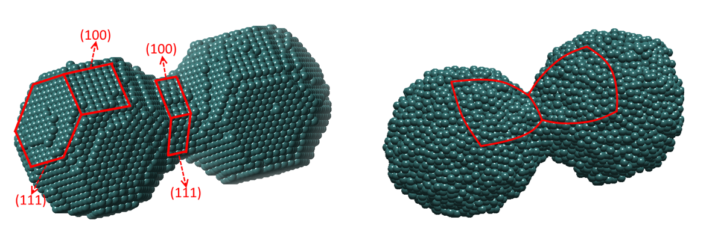
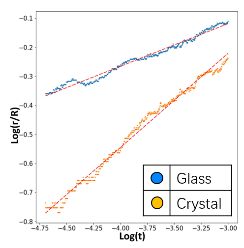

# Lattice-based Kinetic Monte Carlo simulation

## About The Project

Kinetic Monte Carlo simulation is an effective method to understand some stochastic processes in condensed matter physics, such as diffusion process. 
To model atomic diffusion process on lattices, here we build the lattice-based kinetic Monte Carlo algorithm. The hopping probability of atoms is given by:  
$P = \nu exp(-E_A/k_bT)$  
where $E_A$ is the activation energy and the attempt frequency is $\nu = k_bT/h$. Activation energy is defined as $E_A=nE_0$, where $E_0$ is bond energy, and n is bond number, i.e. first coordinate number. The time increment is taken as $\Delta t=-ln⁡(u)/k$, where k is the rate constant for shifting out of a state and u is a random number.  
An example of the usage is the simulation of nanoparticle coalescence process:  
  
This image shows an snapshot of the simulated surface driven coalescence process of two pairs of particles (crystalline and amorphous respectively). The evolution of neck radius is plotted in:  
  
It clearly shows that, the facet behavior of crystalline particles leads to a different coalescence kinetics. This work was published on Tian, Y., Jiao, W., Liu, P., Song, S., Lu, Z., Hirata, A., & Chen, M. (2019). Fast coalescence of metallic glass nanoparticles. Nature Communications, 10(1), 5249. https://doi.org/10.1038/s41467-019-13054-z  

## Usage

This work is partially writen in Cython. The utils/*.pyx file need to be compiled using Cython before it is imported.  
For the rest of the usage, please refer to KMC-crystal.ipynb. 

(<a href="#readme-top">back to top</a>)

## Contact

Yuan Tian - tiany17@uci.com

(<a href="#readme-top">back to top</a>)

